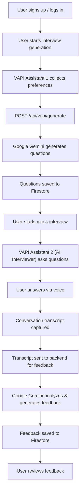

# NexInterview

## Overview

NexInterview is an AI-powered platform designed to help users prepare for job interviews. It offers a personalized experience by generating tailored interview questions based on user-provided criteria and then conducting a mock interview with an AI voice assistant. After the interview, users receive AI-generated feedback on their performance.

## Features

-   **User Authentication**: Secure sign-up and login for users.
-   **Personalized Interview Generation**:
    -   Users specify job role, experience level, desired tech stack, interview type (technical, behavioral, mixed), and number of questions.
    -   AI (Google Gemini) generates relevant interview questions.
-   **Interactive Mock Interviews**:
    -   Conducted by an AI voice assistant (powered by VAPI).
    -   Real-time voice interaction and transcript generation.
-   **AI-Powered Feedback**:
    -   After the mock interview, the transcript is analyzed by AI (likely Google Gemini) to provide constructive feedback.
    -   Users can review feedback to identify areas for improvement.
-   **Interview Management**:
    -   Generated interviews and their corresponding feedback are stored and accessible to the user.

## Tech Stack

-   **Frontend**: Next.js (App Router), React, TypeScript, Tailwind CSS
-   **Backend**: Next.js API Routes, Server Actions
-   **Artificial Intelligence**:
    -   **Google Gemini (via @ai-sdk/google)**: Used for generating interview questions and likely for generating post-interview feedback.
    -   **VAPI**: Used for the conversational AI interface. Two distinct VAPI assistants are utilized:
        1.  An assistant to gather user preferences for interview generation.
        2.  An "interviewer" assistant to conduct the mock interview.
-   **Database**: Firebase Firestore (for storing user data, generated interviews, questions, transcripts, and feedback).
-   **Authentication**: Firebase Authentication.

## Workflow

1.  **User Onboarding & Setup**:
    -   User signs up/logs in.
    -   User initiates the interview generation process.
2.  **Interview Preference Collection (VAPI Assistant 1)**:
    -   An initial VAPI assistant interacts with the user to collect details: job role, experience level, tech stack, interview type (technical/behavioral/mixed), number of questions, username, and userid.
3.  **Question Generation (API & Google Gemini)**:
    -   The VAPI assistant sends the collected data to the `/api/vapi/generate` endpoint in the Next.js backend.
    -   This endpoint uses the Google Gemini model to generate a set of interview questions tailored to the user's specifications.
    -   The generated interview (questions, user details, metadata) is stored in Firestore.
4.  **Mock Interview Session (VAPI Assistant 2)**:
    -   The user selects a generated interview to start a mock session.
    -   The application initializes a second VAPI assistant (the "interviewer"), providing it with the generated questions.
    -   The VAPI interviewer asks the questions, and the user responds via voice. The conversation is transcribed in real-time.
5.  **Feedback Generation & Review**:
    -   Once the mock interview is complete, the captured transcript is sent to a backend process (Next.js Server Action).
    -   This process uses AI (likely Google Gemini) to analyze the transcript and generate detailed feedback on the user's performance.
    -   The feedback is stored in Firestore.
    -   The user is redirected to a page where they can review their feedback.

---

## Mermaid Diagram



---

## Environment Variables

To run this project, you will need to set up the following environment variables in a `.env.local` file. Refer to `env.example` for a template:

-   `NEXT_PUBLIC_FIREBASE_API_KEY`: Firebase API Key.
-   `NEXT_PUBLIC_FIREBASE_AUTH_DOMAIN`: Firebase Authentication domain.
-   `NEXT_PUBLIC_FIREBASE_PROJECT_ID`: Firebase Project ID.
-   `NEXT_PUBLIC_FIREBASE_STORAGE_BUCKET`: Firebase Storage bucket.
-   `NEXT_PUBLIC_FIREBASE_MESSAGING_SENDER_ID`: Firebase Messaging Sender ID.
-   `NEXT_PUBLIC_FIREBASE_APP_ID`: Firebase App ID.
-   `NEXT_PUBLIC_MEASUREMENT_ID`: (Optional) Firebase Analytics Measurement ID.

-   `NEXT_PUBLIC_VAPI_WEB_TOKEN`: VAPI Web Token for frontend SDK initialization.
-   `NEXT_PUBLIC_VAPI_ASSISTANT_ID`: VAPI Assistant ID for the *preference collection* assistant.
    *Note: The VAPI assistant ID for the "interviewer" is likely managed as a constant within the codebase (e.g., `interviewer` in `constants/`).*

-   `NEXT_PUBLIC_BASE_URL`: The base URL of your deployment (e.g., `http://localhost:3000` for local development).

**Server-Side Only:**
-   `FIREBASE_PROJECT_ID`: Firebase Project ID (for Admin SDK).
-   `FIREBASE_PRIVATE_KEY`: Firebase Private Key (for Admin SDK). Remember to escape newlines in the key if copying directly into `.env.local` (e.g., replace `\n` with actual newlines or handle appropriately).
-   `FIREBASE_CLIENT_EMAIL`: Firebase Client Email (for Admin SDK).

-   `GOOGLE_GENERATIVE_AI_API_KEY`: API Key for Google Generative AI (Gemini).

## Setup and Running Locally

1.  **Clone the repository:**
    ```bash
    git clone https://github.com/SiranjeeviK/nexinterview.git
    cd nexinterview
    ```

2.  **Install dependencies:**
    ```bash
    npm install
    # or
    yarn install
    # or
    pnpm install
    ```

3.  **Set up Firebase:**
    -   Create a Firebase project at [https://console.firebase.google.com/](https://console.firebase.google.com/).
    -   Enable Authentication (e.g., Email/Password).
    -   Set up Firestore database.
    -   Obtain your Firebase project credentials and add them to your `.env.local` file.
    -   For server-side Firebase Admin SDK, generate a private key JSON file from Project settings > Service accounts and use its values for `FIREBASE_PROJECT_ID`, `FIREBASE_PRIVATE_KEY`, and `FIREBASE_CLIENT_EMAIL`.

4.  **Set up VAPI:**
    -   Sign up at [VAPI.ai](https://vapi.ai/) (or their relevant website).
    -   Create two assistants:
        1.  One for gathering interview preferences (matching the structure in `docs/vapi_generate_interview_workflow.json`). Note its Assistant ID for `NEXT_PUBLIC_VAPI_ASSISTANT_ID`.
        2.  One for conducting the interview (the "interviewer"). This assistant will need to be configured to receive questions and conduct an interview flow. Its ID will be used in the frontend code (e.g., in `constants/`).
    -   Obtain your VAPI Web Token for `NEXT_PUBLIC_VAPI_WEB_TOKEN`.

5.  **Set up Google Generative AI:**
    -   Obtain an API key from [Google AI Studio](https://aistudio.google.com/) or Google Cloud Console.
    -   Add the key to `GOOGLE_GENERATIVE_AI_API_KEY` in your `.env.local` file.

6.  **Create `.env.local` file:**
    -   Copy `env.example` to `.env.local`.
    -   Fill in all the required environment variables obtained from Firebase, VAPI, and Google AI.

7.  **Run the development server:**
    ```bash
    npm run dev
    # or
    yarn dev
    # or
    pnpm dev
    ```

8.  Open [http://localhost:3000](http://localhost:3000) (or your `NEXT_PUBLIC_BASE_URL`) in your browser to see the application.

---

This README provides a comprehensive guide to understanding, setting up, and running the NexInterview project.
